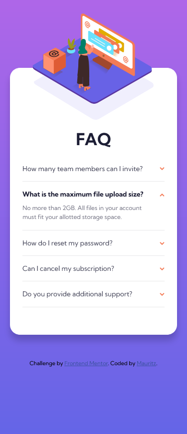
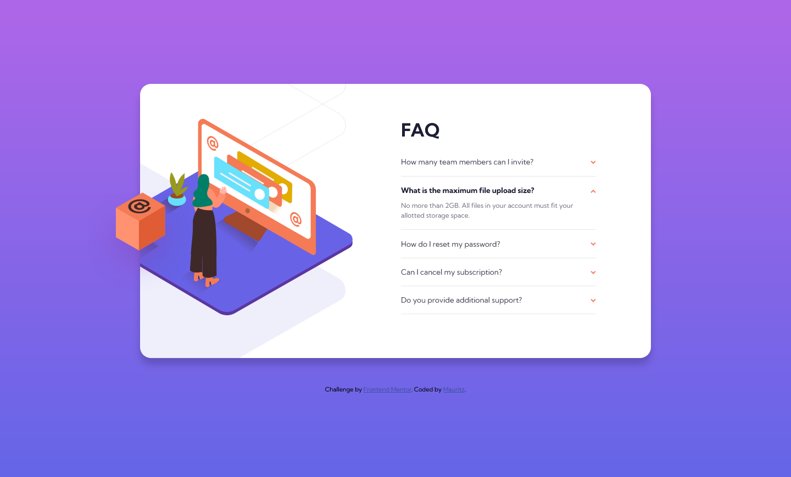

# Frontend Mentor - FAQ accordion card solution

This is a solution to the [FAQ accordion card challenge on Frontend Mentor](https://www.frontendmentor.io/challenges/faq-accordion-card-XlyjD0Oam). Frontend Mentor challenges help you improve your coding skills by building realistic projects. 

## Table of contents

- [Overview](#overview)
  - [The challenge](#the-challenge)
  - [Screenshot](#screenshot)
  - [Links](#links)
- [My process](#my-process)
  - [Built with](#built-with)
  - [What I learned](#what-i-learned)
  - [Continued development](#continued-development)
  - [Useful resources](#useful-resources)
- [Author](#author)

## Overview

### The challenge

Users should be able to:

- View the optimal layout for the component depending on their device's screen size
- See hover states for all interactive elements on the page
- Hide/Show the answer to a question when the question is clicked

### Screenshot




### Links

- Solution URL: [solution URL](https://www.frontendmentor.io/solutions/faq-accordion-card-using-html-css-and-javascript-FRY8tj4eYF)
- Live Site URL: [github pages](https://mauritzlm.github.io/faq-accordion-card/)

## My process

### Built with

- Semantic HTML5 markup
- CSS custom properties
- Flexbox
- Mobile-first workflow

### What I learned

1. I got some good practice using background images and background position during this challenge. At first I did not know how I was going to position the three images for the desktop layout. After a while I thought to use one image as the source for the picture element and I used the other two images as background images for the picture element. It was difficult to get the positioning correct but I managed to get it quite close to the design image.

```css
   picture {
        flex: 50%;
        position: relative;
        left: 0;
        top: 0;
        background-image: url(./images/illustration-woman-online-desktop.svg), url(./images/bg-pattern-desktop.svg);
        background-repeat: no-repeat;
        background-position: left -85px top 45%, 118% 67%;    
    }

    picture img {
        position: absolute;
        bottom: 12em;
        left: -9.5em;
    }
```

2. I learned that an absolute positioned element is positioned relative to its closest positioned ancestor (https://developer.mozilla.org/en-US/docs/Web/CSS/position).
I used this to position the image for mobile layout. This makes it so that image sticks to its parent element (main in this case).

```css
main {
   position: relative;
}

picture {
   position: absolute;
}
```

### Continued development

1. I want to improve working with position, it can be really tricky to use position and make things responsive. I think understanding the properties better will help.

2. When I finished the mobile styles I realized I didn't section the questions (the H1 and the list of questions). Luckily it was easy to implement, but I think on a different project it might have been a problem. So I do want to learn to think the project through and plan better before starting. 

### Useful resources

- [mdn position reference](https://developer.mozilla.org/en-US/docs/Web/CSS/position) - This helped me understand absolute positioning better.
- [mdn background position reference](https://developer.mozilla.org/en-US/docs/Web/CSS/background-position) - Very useful article to help with the values and keywords.

## Author

- Frontend Mentor - [@MauritzLM](https://www.frontendmentor.io/profile/MauritzLM)

